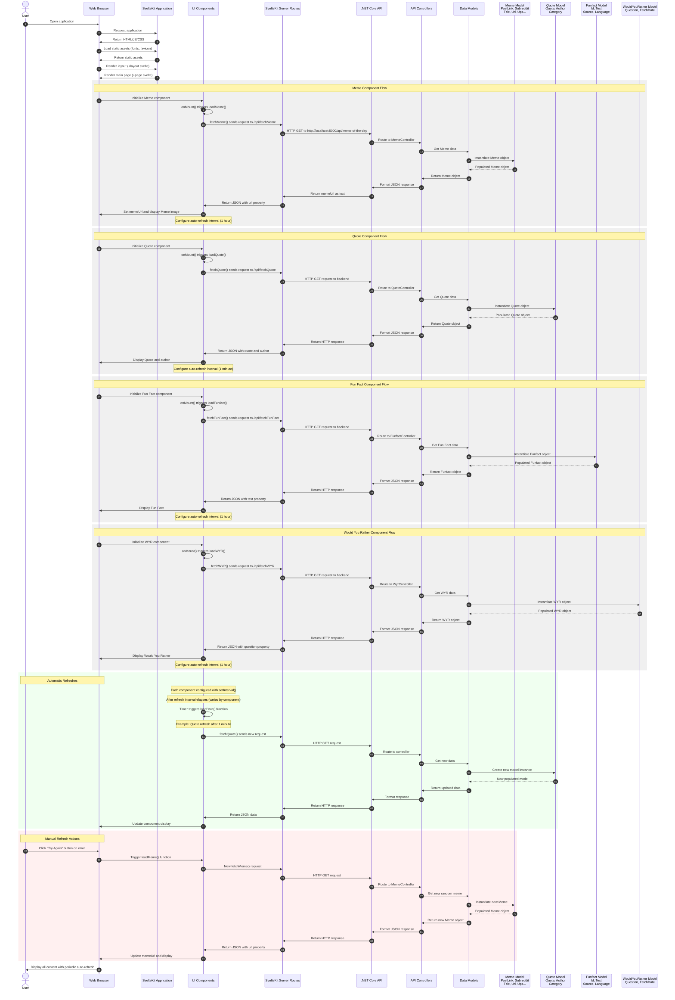

```mermaid
sequenceDiagram
    autonumber
    actor User
    participant Browser as Web Browser
    participant SvelteApp as SvelteKit Application
    participant Components as UI Components
    participant FrontendAPI as SvelteKit Server Routes
    participant BackendAPI as .NET Core API
    participant Controllers as API Controllers
    participant Models as Data Models
    participant MemeModel as Meme Model<br>PostLink, Subreddit<br>Title, Url, Ups...
    participant QuoteModel as Quote Model<br>Quote, Author<br>Category
    participant FunfactModel as Funfact Model<br>Id, Text<br>Source, Language
    participant WYRModel as WouldYouRather Model<br>Question, FetchDate
    
    %% Initial application load
    User->>Browser: Open application
    Browser->>SvelteApp: Request application
    SvelteApp->>Browser: Return HTML/JS/CSS
    Browser->>SvelteApp: Load static assets (fonts, favicon)
    SvelteApp->>Browser: Return static assets
    
    %% Layout and page rendering
    Browser->>SvelteApp: Render layout (+layout.svelte)
    SvelteApp->>Browser: Render main page (+page.svelte)
    
    %% Component initialization and data loading (parallel processes)
    rect rgb(240, 240, 240)
        Note over Browser,WYRModel: Meme Component Flow
        Browser->>Components: Initialize Meme component
        Components->>Components: onMount() triggers loadMeme()
        Components->>FrontendAPI: fetchMeme() sends request to /api/fetchMeme
        FrontendAPI->>BackendAPI: HTTP GET to http://localhost:5000/api/meme-of-the-day
        BackendAPI->>Controllers: Route to MemeController
        Controllers->>Models: Get Meme data
        Models->>MemeModel: Instantiate Meme object
        MemeModel-->>Models: Populated Meme object
        Models->>Controllers: Return Meme object
        Controllers->>BackendAPI: Format JSON response
        BackendAPI->>FrontendAPI: Return memeUrl as text
        FrontendAPI->>Components: Return JSON with url property
        Components->>Browser: Set memeUrl and display Meme image
        Note over Components: Configure auto-refresh interval (1 hour)
    end
    
    rect rgb(240, 240, 240)
        Note over Browser,WYRModel: Quote Component Flow
        Browser->>Components: Initialize Quote component
        Components->>Components: onMount() triggers loadQuote()
        Components->>FrontendAPI: fetchQuote() sends request to /api/fetchQuote
        FrontendAPI->>BackendAPI: HTTP GET request to backend
        BackendAPI->>Controllers: Route to QuoteController
        Controllers->>Models: Get Quote data
        Models->>QuoteModel: Instantiate Quote object
        QuoteModel-->>Models: Populated Quote object
        Models->>Controllers: Return Quote object
        Controllers->>BackendAPI: Format JSON response
        BackendAPI->>FrontendAPI: Return HTTP response
        FrontendAPI->>Components: Return JSON with quote and author
        Components->>Browser: Display Quote and author
        Note over Components: Configure auto-refresh interval (1 minute)
    end
    
    rect rgb(240, 240, 240)
        Note over Browser,WYRModel: Fun Fact Component Flow
        Browser->>Components: Initialize Fun Fact component
        Components->>Components: onMount() triggers loadFunfact()
        Components->>FrontendAPI: fetchFunFact() sends request to /api/fetchFunFact
        FrontendAPI->>BackendAPI: HTTP GET request to backend
        BackendAPI->>Controllers: Route to FunfactController
        Controllers->>Models: Get Fun Fact data
        Models->>FunfactModel: Instantiate Funfact object
        FunfactModel-->>Models: Populated Funfact object
        Models->>Controllers: Return Funfact object
        Controllers->>BackendAPI: Format JSON response
        BackendAPI->>FrontendAPI: Return HTTP response
        FrontendAPI->>Components: Return JSON with text property
        Components->>Browser: Display Fun Fact
        Note over Components: Configure auto-refresh interval (1 hour)
    end
    
    rect rgb(240, 240, 240)
        Note over Browser,WYRModel: Would You Rather Component Flow
        Browser->>Components: Initialize WYR component
        Components->>Components: onMount() triggers loadWYR()
        Components->>FrontendAPI: fetchWYR() sends request to /api/fetchWYR
        FrontendAPI->>BackendAPI: HTTP GET request to backend
        BackendAPI->>Controllers: Route to WyrController
        Controllers->>Models: Get WYR data
        Models->>WYRModel: Instantiate WYR object
        WYRModel-->>Models: Populated WYR object
        Models->>Controllers: Return WYR object
        Controllers->>BackendAPI: Format JSON response
        BackendAPI->>FrontendAPI: Return HTTP response
        FrontendAPI->>Components: Return JSON with question property
        Components->>Browser: Display Would You Rather
        Note over Components: Configure auto-refresh interval (1 hour)
    end
    
    %% Automatic refresh flows based on timers
    rect rgb(240, 255, 240)
        Note over User,Browser: Automatic Refreshes
        
        %% Auto-refresh timers
        Note over Components: Each component configured with setInterval()
        
        %% Component refresh example
        Note over Components: After refresh interval elapses (varies by component)
        Components->>Components: Timer triggers loadData() function
        
        Note over Components: Example: Quote refresh after 1 minute
        Components->>FrontendAPI: fetchQuote() sends new request
        FrontendAPI->>BackendAPI: HTTP GET request
        BackendAPI->>Controllers: Route to controller
        Controllers->>Models: Get new data
        Models->>QuoteModel: Create new model instance
        QuoteModel-->>Models: New populated model
        Models->>Controllers: Return updated data
        Controllers->>BackendAPI: Format response
        BackendAPI->>FrontendAPI: Return HTTP response
        FrontendAPI->>Components: Return JSON data
        Components->>Browser: Update component display
    end
    
    %% Manual refresh flows
    rect rgb(255, 240, 240)
        Note over User,Browser: Manual Refresh Actions
        
        %% Meme manual refresh
        User->>Browser: Click "Try Again" button on error
        Browser->>Components: Trigger loadMeme() function
        
        Components->>FrontendAPI: New fetchMeme() request
        FrontendAPI->>BackendAPI: HTTP GET request
        BackendAPI->>Controllers: Route to MemeController
        Controllers->>Models: Get new random meme
        Models->>MemeModel: Instantiate new Meme
        MemeModel-->>Models: Populated Meme object
        Models->>Controllers: Return new Meme object
        Controllers->>BackendAPI: Format JSON response
        BackendAPI->>FrontendAPI: Return HTTP response
        FrontendAPI->>Components: Return JSON with url property
        Components->>Browser: Update memeUrl and display
    end
    
    %% Final state
    Browser->>User: Display all content with periodic auto-refresh
```
