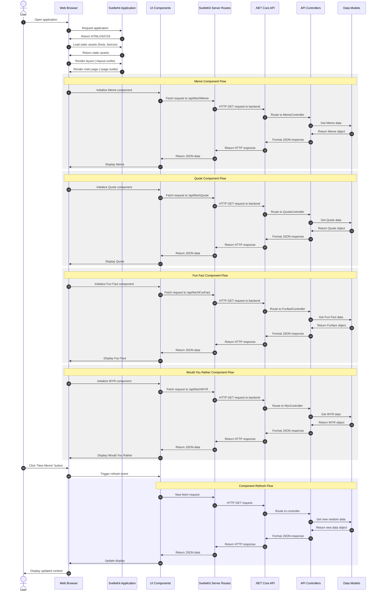

```mermaid
sequenceDiagram
    autonumber
    actor User
    participant Browser as Web Browser
    participant SvelteApp as SvelteKit Application
    participant Components as UI Components
    participant FrontendAPI as SvelteKit Server Routes
    participant BackendAPI as .NET Core API
    participant Controllers as API Controllers
    participant Models as Data Models
    
    %% Initial application load
    User->>Browser: Open application
    Browser->>SvelteApp: Request application
    SvelteApp->>Browser: Return HTML/JS/CSS
    Browser->>SvelteApp: Load static assets (fonts, favicon)
    SvelteApp->>Browser: Return static assets
    
    %% Layout and page rendering
    Browser->>SvelteApp: Render layout (+layout.svelte)
    SvelteApp->>Browser: Render main page (+page.svelte)
    
    %% Component initialization and data loading (parallel processes)
    rect rgb(240, 240, 240)
        Note over Browser,Models: Meme Component Flow
        Browser->>Components: Initialize Meme component
        Components->>FrontendAPI: Fetch request to /api/fetchMeme
        FrontendAPI->>BackendAPI: HTTP GET request to backend
        BackendAPI->>Controllers: Route to MemeController
        Controllers->>Models: Get Meme data
        Models->>Controllers: Return Meme object
        Controllers->>BackendAPI: Format JSON response
        BackendAPI->>FrontendAPI: Return HTTP response
        FrontendAPI->>Components: Return JSON data
        Components->>Browser: Display Meme
    end
    
    rect rgb(240, 240, 240)
        Note over Browser,Models: Quote Component Flow
        Browser->>Components: Initialize Quote component
        Components->>FrontendAPI: Fetch request to /api/fetchQuote
        FrontendAPI->>BackendAPI: HTTP GET request to backend
        BackendAPI->>Controllers: Route to QuoteController
        Controllers->>Models: Get Quote data
        Models->>Controllers: Return Quote object
        Controllers->>BackendAPI: Format JSON response
        BackendAPI->>FrontendAPI: Return HTTP response
        FrontendAPI->>Components: Return JSON data
        Components->>Browser: Display Quote
    end
    
    rect rgb(240, 240, 240)
        Note over Browser,Models: Fun Fact Component Flow
        Browser->>Components: Initialize Fun Fact component
        Components->>FrontendAPI: Fetch request to /api/fetchFunFact
        FrontendAPI->>BackendAPI: HTTP GET request to backend
        BackendAPI->>Controllers: Route to FunfactController
        Controllers->>Models: Get Fun Fact data
        Models->>Controllers: Return Funfact object
        Controllers->>BackendAPI: Format JSON response
        BackendAPI->>FrontendAPI: Return HTTP response
        FrontendAPI->>Components: Return JSON data
        Components->>Browser: Display Fun Fact
    end
    
    rect rgb(240, 240, 240)
        Note over Browser,Models: Would You Rather Component Flow
        Browser->>Components: Initialize WYR component
        Components->>FrontendAPI: Fetch request to /api/fetchWYR
        FrontendAPI->>BackendAPI: HTTP GET request to backend
        BackendAPI->>Controllers: Route to WyrController
        Controllers->>Models: Get WYR data
        Models->>Controllers: Return WYR object
        Controllers->>BackendAPI: Format JSON response
        BackendAPI->>FrontendAPI: Return HTTP response
        FrontendAPI->>Components: Return JSON data
        Components->>Browser: Display Would You Rather
    end
    
    %% User interaction example - refreshing a component
    User->>Browser: Click "New Meme" button
    Browser->>Components: Trigger refresh event
    
    rect rgb(240, 240, 255)
        Note over Components,Models: Component Refresh Flow
        Components->>FrontendAPI: New fetch request
        FrontendAPI->>BackendAPI: HTTP GET request
        BackendAPI->>Controllers: Route to controller
        Controllers->>Models: Get new random data
        Models->>Controllers: Return new data object
        Controllers->>BackendAPI: Format JSON response
        BackendAPI->>FrontendAPI: Return HTTP response
        FrontendAPI->>Components: Return JSON data
        Components->>Browser: Update display
    end
    
    %% Final user view
    Browser->>User: Display updated content
```
